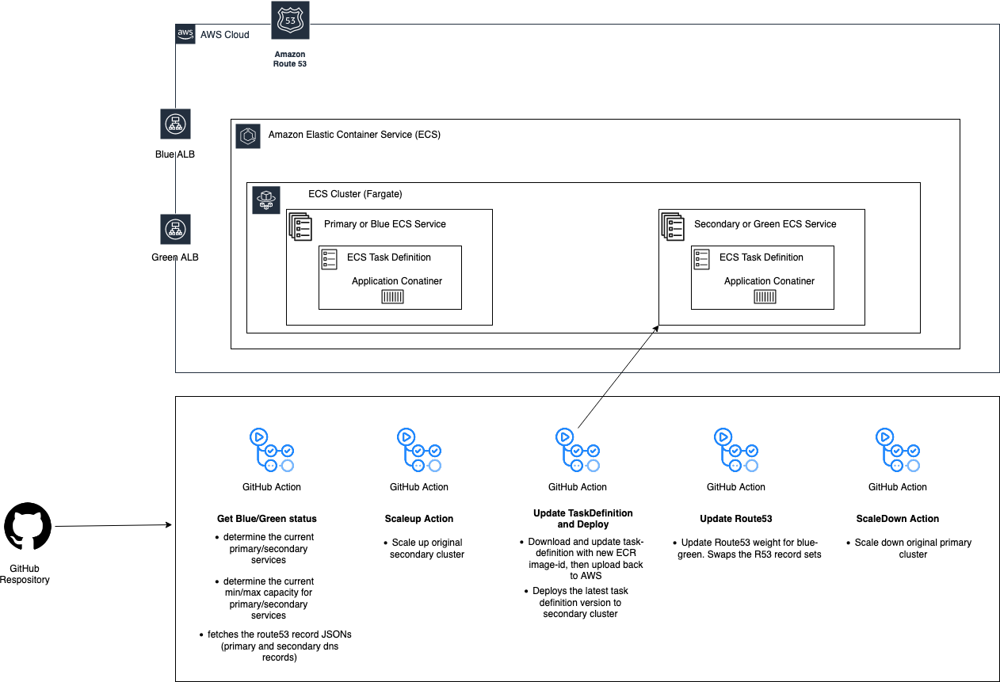

### Assessment task

#### Requirements
* Create a network with public & private subnets (please consider a meaningful CIDR).
* Create a load balancer which redirects requests from port 80 to 443.
* Create an AWS ECS Fargate cluster and run 2 tasks there using a standard Nginx image (round-robin).
* (Optional) Create a Blue/Green deployment pipeline (preferably using GitHub Actions) to deploy a new version of the image without downtime.
* If you could not implement it: Explain the whole deployment process in a CI/CD pipeline, from code to production. You can make use of text, diagrams, slides, etc. The solution will be discussed during the interview.

### Architecture


#### Solution Explained
We are configuring GitHub Action to trigger multiple phases of Blue/Green deployment into two ECS Fargate Cluster Services' ALBs; primary and secondary ALBs or blue and green ALB.

Following are the 5 different GH Actions required to achieve this.


1. Get blue-green status from Route53
    - fetches R53 records for both primary and secondary ALB. example -> 1-alb(weight 100%) and 2-alb(weight 0%)
    - determine the current primary/secondary blue/green ECS services
    - determine the current min/max capacity for primary/secondary ECS services
1. Scale up original secondary cluster
1. Download and update task-definition with new ECR image-id, then upload back to AWS
 1. Update Route53 weight for blue-green. So that secondary will have 100% and primary will have 0%.
1. Scale down original primary cluster

Following are the environment variables which needs to be injected into GH Actions for it to  
env:  
  AWS_ACCOUNT_ID_QA: 123456789012  
  AWS_DEFAULT_REGION: us-west-2  
  AWS_DEFAULT_OUTPUT: json  

  HOSTED_ZONE_ID: Z1234567890ABC  
  ZONE_NAME: example.com.  
  ECS_CLUSTER: assessment-cluster-blue  
  SERVICE_BLUE: assessment-service-blue  
  SERVICE_GREEN: assessment-service-green  
  REPO_NAME: assessment-gh-repo  


# Deploying Terraform
We are using terragrunt to deploy DRY-Terraform code into 3 environments; dev, prod and test.

folder structure:
```
├── live  
│   ├── dev  
│   │   └── assessment  
│   │       └── terragrunt.hcl  
│   ├── prod  
│   │   └── assessment  
│   │       └── terragrunt.hcl  
│   ├── terragrunt.hcl  
│   └── test    
│       └── assessment  
│           └── terragrunt.hcl  
└── modules  
    └── assessment  
        ├── main.tf  
        ├── template  
        │   └── container_def.json.tpl  
        ├── terraform.tfvars  
        └── variables.tf  
```
To deploy into dev environment
```
cd live/dev/assessment
terragrunt plan
terragrunt apply
```


To deploy into test environment
```
cd live/test/assessment
terragrunt plan
terragrunt apply
```


To deploy into prod environment
```
cd live/prod/assessment
terragrunt plan
terragrunt apply
```


#### References
https://registry.terraform.io/providers/hashicorp/aws/latest/docs    
https://www.architect.io/blog/2021-03-30/create-and-manage-an-aws-ecs-cluster-with-terraform/.   
https://blog.gruntwork.io/how-to-manage-multiple-environments-with-terraform-using-terragrunt-2c3e32fc60a8.   
https://cwong47.gitlab.io/technology-blue-green-deployment/.   
